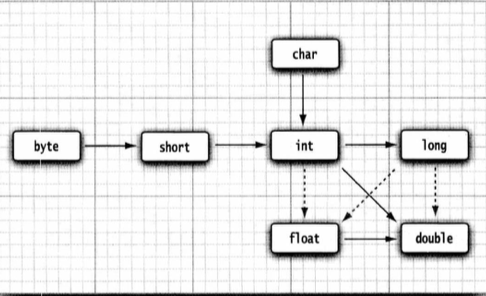

# Java的基本程序设计结构

## 注释

在Java中，有三种标记注释的方式。

```java
// 单行注释

/*
	多行注释
*/

/**
	JavaDoc注释（文档注释）Java中可以用来自动生成文档，需要用javadoc命令生成文档
*/
```

## 数据类型

Java是一种强类型语言。这就意味着必须为每一个变量声明一种类型。在Java中，一共有八种基本数据类型。

### 整型

整型表示没有小数部分的数据，允许是负数。Java中有四种整型。

| 类型  | 存储  | 取值范围                  |
| ----- | ----- | ------------------------- |
| byte  | 1字节 | $-2^{8-1}～2^{8-1}$       |
| short | 2字节 | $-2^{2*8-1}～2^{2*8-1}-1$ |
| int   | 4字节 | $-2^{4*8-1}～2^{4*8-1}-1$ |
| long  | 8字节 | $-2^{8*8-1}～2^{8*8-1}-1$ |

> 长整型数值有一个后缀L或l 

### 浮点类型

| 类型   | 存储  | 取值范围                                               |
| ------ | ----- | ------------------------------------------------------ |
| float  | 4字节 | 大约$\pm$3.402 823 47E+38F(有效位数6～7位)             |
| double | 8字节 | 大约$\pm$1.797 693 134 862 315 70E+308(有效位数为15位) |

> float类型的数值有一个后缀F或f。没有后缀F的浮点数默认是double类型

### char类型

char类型用于表示单个字符。char类型的字面量值需要使用单引号括起来。例如：'A'

### boolean类型

boolean(布尔)类型有两个值，false和true，用来判定逻辑条件。整型值和布尔值之间不能进行相互转换。

## 变量与常量

Java中使用变量来存储值，常量就是值不变的变量。

### 声明变量

在Java中，每个变量都有一个类型（type）。在声明变量时，先指定变量的类型，然后是变量名。每个声明都以分号结尾。不能使用Java保留字作为变量名。

```java
// 变量的声明
double salary;
int vacationDays;
long earthPopulation;
boolean done;
```

> 变量的命名规则：
>
> - 变量名必须是一个以字母开头并由字母或数字构成的序列
>
> - Java中变量命名采用小驼峰的方式，即第一个单词的首字母小写，第二个单词的首字母大写。
> - 变量命名需要见名知意

### 变量初始化

声明一个变量后，必须用赋值语句对变量进行显示初始化，不能使用未初始化的变量的值。

```java
int vacationDays;
vacationDays = 12;
```

> Java中可以将变量声明放在代码中的任何位置。在Java中，变量的声明尽可能地靠近变量第一次使用的地方。

### 常量

- 常量声明

Java中，使用关键字`final`指示常量。

```java
public class Constants{
  pubilc static void main(String[] args){
    final double CM_PER_INCH = 2.54;
    double paperWidth = 8.5;
    double paperHeight = 11;
    System.out.println("Paper size in centimeters: " + paperWidth * CM_PER_INCH + " by " + paperHeight * CM_PER_INCH);
  }
}
```

> 关键字final表示这个变量只能被赋值一次。一旦赋值之后，就不能再更改。习惯上，常量名使用全大写加下划线的方式。

- 类常量

在Java中，经常希望某个常量可以在一个类的多个方法中使用，通常将这些常量称为`类常量`,可以使用关键字`static final`设置一个类常量。示例：

```java
public class Constants2{
  public static final double CH_PER_INCH = 2.54;
  
  public static void main(String[] args){
    double paperWidth = 8.5;
    double paperHeight = 11;
    System.out.println("Paper size in centimeters: " + paperWidth * CH_PER_INCH + "by " + paperHeight * CH_PER_INCH);
  }
}
```

> 类常量位于main方法的外部，因此，同一个类的其他方法也可以使用这个常量。如果一个常量被声明为public，那么其他类的方法也可以使用这个常量。

### 枚举类型

有时候，变量的取值只在一个有限的集合内，这就是枚举。枚举类型包含有限个命名的值。使用关键字`enum`来定义枚举类。例如：

```java
enum size {SMALL,MEDIUM,LARGE,EXTRA_LARGE};
```

现在可以声明这种类型的变量：

```java
Size s = Size.MEDIUM;
```

> Size类型的变量只能存储这个类型声明中的某个枚举值，或者特殊值null。
>
> null表示这个变量没有设置任何值。

关于枚举的详细内容参考：xxx

## 运算符

运算符用于连接值。Java提供了一组丰富的算术和逻辑运算符以及数学函数。

### 算术运算符

- 在Java中，使用算数运算符`+、-、*、/`表示加减乘除运算。当参与/运算的两个操作数都是整数是，表示整数除法。
- 整数的求余操作（也称为取模）使用%表示。例如：15/2等于1，15%2等于1，15.0%2等于7.5。

> 整数被0除将会产生一个异常，而浮点数被0除将会得到无穷大或NaN结果。

### 数学函数与常量

在Math类中，包含了各种各样的数学函数。

- bas函数

abs函数用于返回一个数字的绝对值。该函数接受一个参数，可以是任何整型类型或浮点类型。如果参数是正数，则返回该数本身；如果参数为负数，则返回其相反数。如果参数是NaN(不是数字)，则返回NaN。示例：

```java
public class MathAbsExample{
  public static void main(String[] args){
    int number1 = -19;
    double number2 = -20.5;
    
    // 计算两个数的绝对值
    int absNumber1 = Math.abs(number1);
    double absNumber2 = Math.abd(number2);
    
    System.out.println("绝对值:" + absNumber1);
    System.out.println("绝对值:" + absNumber1);
  }
}
```

输出：

```java
绝对值：10
绝对值：20.5
```

- cell函数

cell函数用于返回大于等于给定参数的最小整数。该函数接受一个double类型的参数，并返回一个double类型的结果。如果参数是NaN(不是数字)，则返回NaN。示例：

```java
public class MathCeilExample {
    public static void main(String[] args) {
        double number1 = 12.4;
        double number2 = -8.6;
        
        // 计算两个数的向上取整
        double ceilNumber1 = Math.ceil(number1);
        double ceilNumber2 = Math.ceil(number2);
        
        System.out.println("向上取整：" + ceilNumber1);
        System.out.println("向上取整：" + ceilNumber2);
    }
}
```

输出：

```java
向上取整：13.0
向上取整：-8.0
```

> 当参数为正数时，向上取整是取大于等于该数的最小整数；但参数为负数时，向上取整是取小于等于该数的最大整数。

- floor函数

floor函数用于返回一个小于等于给定参数的最大整数。该函数接受一个参数，可以是任何浮点类型，包括float和double。示例：

```java
public class MathFloorExample {
    public static void main(String[] args) {
        double number1 = 10.5;
        double number2 = -20.5;
       
        // 计算两个数的floor值
        double floorNumber1 = Math.floor(number1);
        double floorNumber2 = Math.floor(number2);
        
        System.out.println("floor值：" + floorNumber1);
        System.out.println("floor值：" + floorNumber2);
    }
}
```

输出：

```java
floor值：10.0
floor值：-21.0
```

> 如果参数为正数，则返回大于该数的最大整数值；如果参数为负数，则返回不小于该数的最大整数值。

- max函数

max函数用于返回两个数字中的较大值。该函数接受两个参数，可以是任何整数类型或浮点类型。如果两个参数都是NaN,则返回NaN；如果只有一个参数是NaN，则返回另一个参数。如果两个参数相等，则返回第一个参数。示例：

```java
public class MathMaxExample {
    public static void main(String[] args) {
        int number1 = 10;
        double number2 = 20.5;
       
        // 计算两个数的最大值
        int maxNumber1 = Math.max(number1, 15);
        double maxNumber2 = Math.max(number2, 25.5);
        
        System.out.println("最大值：" + maxNumber1);
        System.out.println("最大值：" + maxNumber2);
    }
}
```

输出：

```java
最大值：15
最大值：25.5
```

- min函数

min函数用于返回两个数字中较小值。该函数接受两个参数，可以是任何整数类型和浮点类型。如果第一个参数小于第二个参数，则返回第一个参数；否则返回第二个参数，如果参数是NaN,则返回NaN。示例：
```java
public class MathMinExample {
    public static void main(String[] args) {
        int number1 = 10;
        double number2 = 20.5;
       
        // 计算两个数的最小值
        int minNumber = Math.min(number1, 15);
        double minNumber2 = Math.min(number2, 10.5);
 
        System.out.println("最小值：" + minNumber);
        System.out.println("最小值：" + minNumber2);
    }
}
```

输出:

```java
最小值：10
最小值：10.5
```

### 数值类型之间的转换

在实际开发中，经常需要将一种数值类型转换为另一种数值类型。



图中的实线箭头表示无信息丢失的转换；虚线剪头表示可能有精度损失的转换。

当一个二元运算符连接两个值时（例如n+f，n是整数，f是浮点数)，先要将两个操作数转换为同一种类型，然后进行计算。

转换规则：

- 如果两个操作数中有一个是double类型，另一个操作数也会转换为double类型。
- 如果两个操作数中有一个是float类型，另一个操作数将会转换为float类型。
- 如果两个操作数中有一个是long类型，另一个操作数将会转换为long类型。
- 其他的都会转换成int类型。

### 强制类型转换

Java中的强制类型转换有两种形式，基本类型转换和引用数据类型转换。基本数据类型的转换，一般发生在需要将大范围数值转换为小范围数值（int类型转换为short类型），或者将高精度类型转换为低精度类型（double类型转换为int类型），这种转换需要通过**强制类型转换**来完成。强制类型转换的语法格式是在圆括号中给出想要转换的目标类型，后边紧跟待转换的变量名。例如
```java
double x = 9.997;
int nx = (int)x; // 9,强制类型转换通过截断小数部分将浮点数值转换为整型。
```

引用数据类型的强制类型转换：xxxx

### 结合赋值和运算符

Java中，可以在赋值中使用二元运算符，例如：

```java
x += 4;
// 等价于
x = x + 4;
```

一般来说，要把运算符放在 = 号左边，如 *= 或 %=。

> 如果运算符得到一个值，其类型与左侧操作数的类型不同，就会发生强制类型转换。

### 自增与自减运算符

- 自增：++
- 自减：--

n++将变量n的当前值加1，n--将n的值减1。

- 前缀和后缀
  - 前缀：先加减，后计算
  - 后缀：先计算，后加减

### 关系和boolean运算符

- 关系运算符

  - `==`:检测相等性

  ```java
  3==7; //false
  ```

  - `!=`:检测不相等

  ```java
  3 != 7; //true
  ```

  - `<、>、<=、>=`:比较大小

- 逻辑运算符

  - `&&`:逻辑与（短路运算）
  - `||`:逻辑或（短路运算）
  - `!`:逻辑非


>短路运算特点：
>
>- expr1 && expr2:若expr1为false，不计算expr2
>- expr1 || expr2:若expr1为true，不计算expr2

- 三元运算符

  - 语法：表达式 ? 值1 : 值2;
  - 示例：

  ```java
  x < y ? 1 : 0;
  ```


### 位运算符

- 基本位运算符

  - `&`:按位与
  - `|`:按位或
  - `^`:按位异或
  - `～`:按位非

  示例：

  ```java
  // 检查 n 的二进制从右数第 4 位是否为 1
  int fourthBitFromRight = (n & 0b1000) / 0b1000;
  // 或使用移位操作：
  int fourthBitFromRight = (n & (1 << 3)) >> 3;
  ```
  
- 位移运算符

  - `<<`:左移（低位补0）
  - `>>`:右移（高位补符号位）
  - `>>>`:无符号右移（高位补0）
  

>右操作数会被模32（long类型模64）例如：`1 << 35`等价于`1 << 3`

### 括号与运算符优先级

优先级规则

- 不使用括号时按优先级顺序计算
- 同级别运算符从左向右计算（除右结合运算符外）
- 右结合运算符包括：`=、+=、-=、?:`等

示例：

```java
a && b || c     // 等价于 (a && b) || c
a += b += c     // 等价于 a += (b += c)
```


